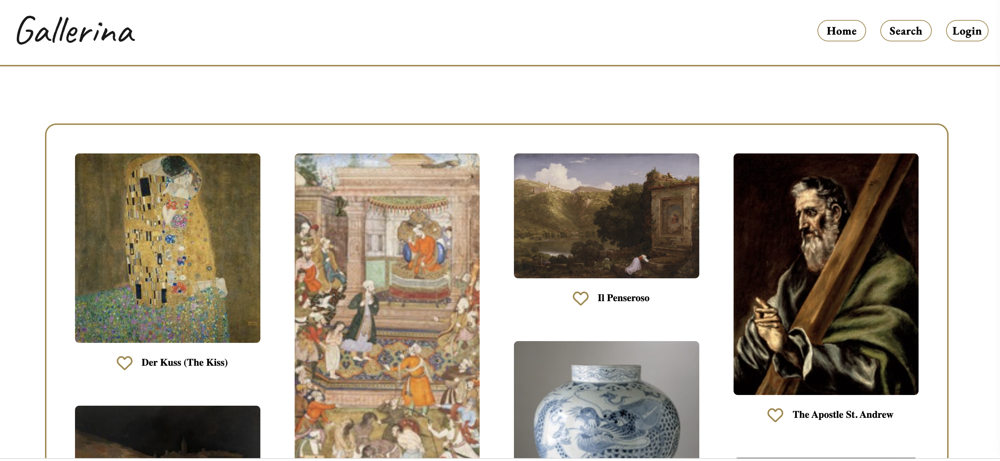

# GALLERINA 🖼️

Gallerina is an art curation website which allows a user to create their own idyllic curations of some of the most famous art pieces in the world.
Inspired by the likes of Pinterest and gallery-style websites, our system uses the Artsy API to generate our data allowing users to save them to their collections.



## How to use

Clone this repo, navigate to it, install packages, run migrations and seeds, and start the server.
  <details style="padding-left: 2em">
    <summary>Tip</summary>

  ```sh
  cd gallerina
  npm i
  npm run knex migrate:latest
  npm run knex seed:run
  npm run dev
  ```

  </details>


### Our stack

#### Backend
- Node.js
- Express
- Knex
- SQLite3 

#### Frontend
- React and Redux for state management
- Tailwind for styling


#### Extra Packages
- Headless-UI

You can find the server running on [http://localhost:3000](http://localhost:3000).
